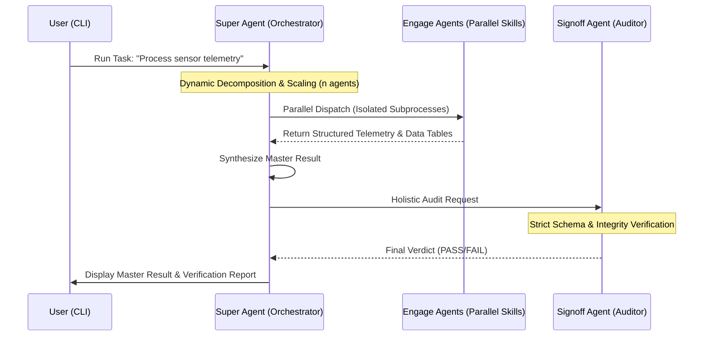

# Multi-Agent Scaffolding Architecture (MASA)

MASA is a dynamic, multi-agent task-decomposition and orchestration framework built with security, isolation, and holistic verification at its core.

It implements the **Super-Engage-Signoff** agentic workflow pattern:
1. **Super Agent (Architect)**: Dynamically analyzes high-level user objectives and partitions tasks across $n$ Engage Agents, assigning appropriate models and skills.
2. **Engage Agents (Specialists)**: Concurrently execute discrete sub-tasks in isolated, sandboxed environments with structured JSON telemetry.
3. **Signoff Agent (Auditor)**: Performs holistic quality assurance, verifying schema compliance, data integrity, and complete goal satisfaction to issue a final `PASS` or `FAIL` signoff.

---

## Architecture Overview



---

## Key Features & Security Hardening

- **Dynamic Task Decomposition**: Intelligently partitions input datasets or multi-domain objectives into optimal chunks for parallel agent execution.
- **Strict Skill Allowlisting**: Skills are verified against an approved registry and checked for canonical path boundaries to prevent arbitrary code execution and directory traversal (`CVE-like` mitigation).
- **Environment & Process Isolation**: Subprocesses are spawned in stripped environments without exposing host credentials, tokens, or private secrets.
- **Cross-Platform Sandboxing**: Limits process memory and CPU via `resource` on Linux and **Job Objects** on Windows (`pywin32`) to prevent rogue agents from crashing the host.
- **Containerized Execution**: Optional support to spawn Engage agents in isolated `podman`/`docker` containers for absolute multi-tenant sandboxing.
- **Collision-Free Mailbox Isolation**: Each execution run is scoped by a unique `run_id` with separate sub-directories per task (`mailboxes/<run_id>/tasks/<task_id>/`), preventing concurrency race conditions.
- **Distributed Scaling**: Supports external brokers (e.g. `redis`) via a decoupled `TaskBroker` interface for horizontal horizontal orchestration.
- **Holistic Auditor Engine**: Replaces fragile magic-string tokens with rigorous JSON schema and data integrity assertions. Uses `ContentSanitizer` to catch sensitive leaks (PII, SSH keys, etc.) and escapes Markdown tables to prevent XSS. Includes a hardcoded `Meta-Auditor` to ensure the Signoff agent doesn't maliciously forge a `PASS`.
- **Hardened Secret Storage**: Uses the OS-native Keystore (`keyring` / Credential Manager / Keychain) to store the framework's master encryption keys safely off-disk.
- **Telemetry & Credential Redaction**: Built-in logging filter redacts API keys, Bearer tokens, passwords, and sensitive strings from logs.

---

## Installation & Shipping Options

MASA can be distributed and installed in three flexible ways depending on the target user:

### Option 1: One-Click Installer (`./install.sh`) ⭐ (Recommended)
Automatically sets up the `masa` CLI command, pre-approves workspace folder trust, and validates your subscriptions:
```bash
git clone <repo-url>
cd MASO
./install.sh
```

### Option 2: Portable Copy-Paste
You can run the framework by executing the package directly, provided you have Python 3.9+ and the lightweight dependencies installed (`pip install -e .`):
```bash
cd MASO
python3 masa/framework.py status
python3 masa/framework.py run "Process sensor telemetry"
```

### Option 3: Python Package (`pip install`)
For developers or standard Python environments:
```bash
# Standard editable install
pip install -e .

# Or with test dependencies
pip install -e ".[dev]"
```

---

## CLI Usage

### 1. Check Subscription Status & Active Sessions
Verify which CLI subscriptions are currently authenticated on your machine:
```bash
masa status
# or: ./scripts/check_status.sh
```

### 2. Log In to a Subscription via Shell
Authenticate any of your paid subscriptions using interactive CLI flows:
```bash
# Log in to Antigravity CLI (AGY)
masa login agy          # or: ./scripts/login_agy.sh

# Log in to Claude Code
masa login claude       # or: ./scripts/login_claude.sh

# Log in to GitHub Copilot / Codex
masa login codex        # or: ./scripts/login_codex.sh

# Configure Local AI (LM Studio, Ollama, AI Rig, BIONIC)
masa login local        # or: masa setup-local (defaults to localhost:1234, auto-queries models)
```

### 3. Pre-Approve Folder Trust (Skip 'Trust this folder?' Prompts)
Pre-approves the current project or any directory so Claude Code and AGY never display interactive confirmation prompts:
```bash
masa trust
# or specify a path: masa trust /path/to/project
# or shell script: ./scripts/trust_folder.sh
```

### 4. Configure User Model Preferences (Setup)
Run the interactive wizard (asks whether to set up local AI or continue with available subscriptions):
```bash
masa setup
```
Or specify models directly via CLI flags:
```bash
masa setup \
  --super "gemini-1.5-pro" \
  --signoff "claude-3-5-sonnet" \
  --engage "gemini-1.5-flash,gpt-4o-mini"
```

### 5. Run Multi-Agent Orchestration Pipeline
```bash
# Run with default dynamic scaling in the current directory:
masa run "Refine sensor data across all pods"

# Run in any folder of your choice:
cd ~/my-target-folder && masa run "Audit files"
# Or from anywhere via the --workspace flag:
masa run "Process telemetry" --workspace ~/my-target-folder

# Run with explicit number of Engage agents:
masa run "Process sensor batch" --num-agents 4

# Run with custom input dataset:
masa run "Process telemetry" --input-file custom_data.json

# Run with model overrides:
masa run "Process telemetry" --super "gemini-1.5-pro" --signoff "claude-3-5-sonnet"
```

### 6. Holistic Audit Verification (Signoff Agent CLI)
```bash
# Audit a single Engage agent output:
python masa/evals/eval_template.py mailboxes/<run_id>/tasks/subtask-001/output.json

# Audit a synthesized Master Result:
python masa/evals/eval_template.py mailboxes/<run_id>/master_result.json --master
```

### 4. List Registered Skills
```bash
python masa/framework.py list-skills
```

---

## Testing & Quality Assurance

Run the comprehensive test suite with `pytest`:

```bash
pytest -v
```

The test suite validates:
- **`tests/test_framework.py`**: Initialization, configuration hierarchy, dynamic decomposition scaling, and collision-free mailbox isolation.
- **`tests/test_security.py`**: Path traversal blocking, arbitrary code execution rejection, sensitive log redaction, token spoofing rejection, and secure 0600 file permissions.
- **`tests/test_skill.py`**: Data refinement skill execution, Markdown table generation, missing key sanitization (`N/A`), and error escalation.
- **`tests/test_evaluator.py`**: AuditorAssertionEngine schema validation, metrics integrity, and holistic multi-task pass/fail verification.
- **`tests/test_e2e.py`**: Full end-to-end integration with custom datasets and multi-agent execution.

---

## Directory Structure

```text
MASA/
├── .venv/                     # Python virtual environment
├── docs/                      # Documentation
├── mailboxes/                 # Run-scoped isolated telemetry mailboxes
├── masa/                      # Core package
│   ├── __init__.py
│   ├── framework.py           # Main MASA orchestrator & CLI
│   ├── core/
│   │   ├── __init__.py
│   │   └── config.json        # Base system metadata & model defaults
│   ├── evals/
│   │   ├── __init__.py
│   │   └── eval_template.py   # AuditorAssertionEngine & signoff validation
│   ├── scripts/               # Shell scripts for login and workspace trust
│   │   ├── check_status.sh
│   │   ├── login_agy.sh
│   │   ├── login_claude.sh
│   │   ├── login_codex.sh
│   │   ├── login_bionic.sh
│   │   └── trust_folder.sh
│   └── skills/
│       └── sample_skill/
│           ├── skill.py       # Data refinement skill implementation
│           └── skills.md      # Skill behavioral & schema specification
├── tests/                     # Automated pytest suite
├── install.sh                 # One-click installer script
├── instruction.md             # Step-by-step user walkthrough
├── pyproject.toml             # Project packaging & configuration
└── README.md
```

---

## License
MIT License.
